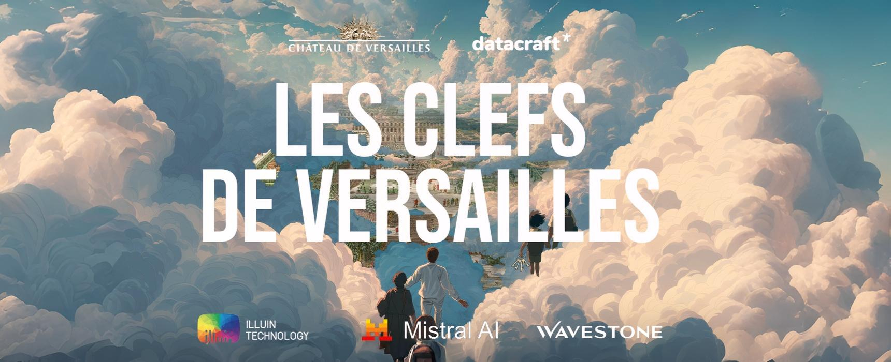
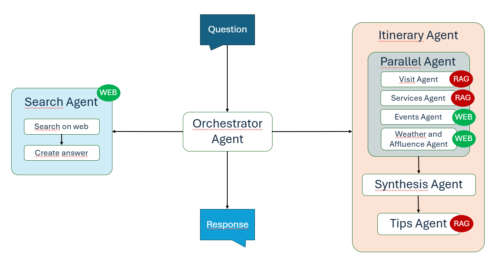

# 🏰 IAllumine — README



Notre solution intègre un système multi-agents afin de produire les itinéraires du château de Versailles les plus adaptés aux demandes des utilsateurs. 

# ✨ Installation

Pour lancer la solution, déplacez-vous à la racine du projet et créez un environnement virtuel avec Python :

`python -m venv .venv`

Activez l'environnement virtuel en vous plaçant au même endroit de création du venv : 

`.venv/Scripts/activate`

Installez les dépendances du `requirements.txt`

`pip install -r requirements.txt`

L'idéal est de posséder un projet Google Cloud Project et de s'authentifier via la CLI gcloud pour que l'application puisse récupérer les credentials via la commande : 

`gcloud auth application-default login`
 
Créez un fichier `.env` à la racine du projet contenant les variables d'environnement :

```
GOOGLE_GENAI_USE_VERTEXAI=TRUE
GOOGLE_CLOUD_PROJECT=[YOUR_PROJECT]
GOOGLE_CLOUD_LOCATION=[YOUR_LOCATION]
```

Vérifiez alors que les agents utilisant du RAG sont configurés correctement avec les bons documents.

Afin de lancer le chatbot, placez-vous à la racine du projet et utilisez la commande 

`adk web` 

Cela vous permettra d'ouvrir l'interface utilisateur en local et d'interagir avec le Chatbot. 
Dans la liste des agents disponibles, sélectinnez orchestrator. 

# 🚀 Solution technique 

Notre solution se base sur l'Agent Development Kit de Google permettant de créer des systèmes multiagents.

Le chatbot est constitué d'un système multiagents avec un orchestrateur principal et deux agents :
- Un agent Itinerary Agent chargé de construire l'itinéraire de l'utilisateur.
- Un agent Search Agent chargé de répondre aux demandes non liés aux itinéraires.

L'agent Itinerary utilise plusieurs agents indépendants chacun spécialisé dans une tâche spécifique lié au chateau de Versailles comme par exemple les évènements, les services ou la météo.
Ces agents indépedants sont appelés en parallèle afin d'optimiser le temps de traitement et l'ensemble des résultats est donné à un agent Synthétiseur chargé de créer l'itinéraire. Enfin, nous intégrons un agent Tips qui rajoute les conseils des données dans le PDF éponyme fourni lors du Hackathon pour produire le résultat final donné à l'utilsateur.



# 👨‍👩‍👧‍👦 Equipe 
- Armad DEBESSE
- Delon UNG
- Hatem YOUNES
- Léa TOPRAK
- Rémi DA SILVA
